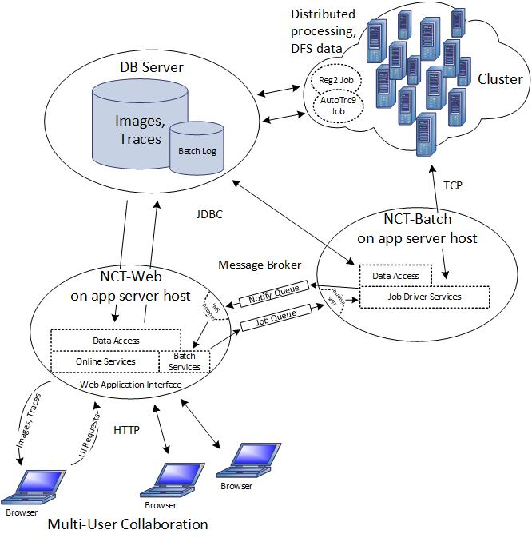
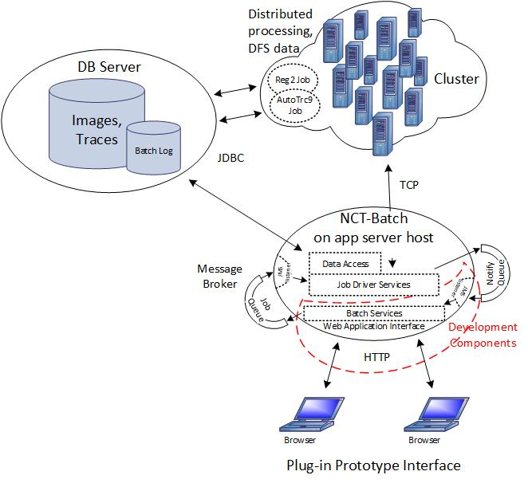
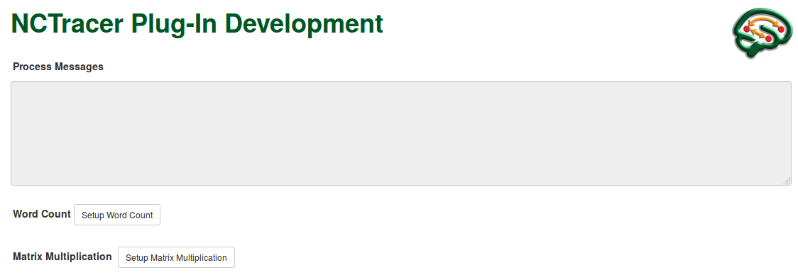
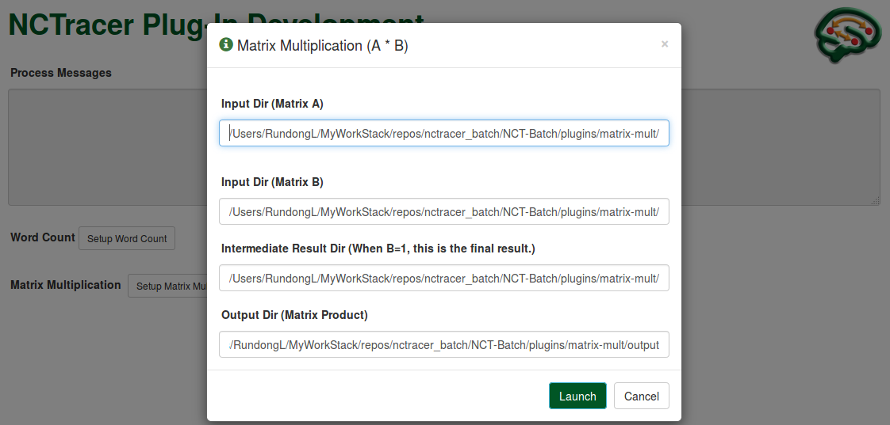

# NCTracer Batch Plugin Development

## Architecture


## Batch Plugin Development Architecture


## Making Batch Server Run
Before starting the Batch Server, we need do some preparation. 
First, edit the NCT-Batch/src/main/webapp/WEB-INF/config.properties. Change the hadoop.root and plugin.root paths to the ones on your own machine. (When you download the NCT-Batch repository, these paths may be set to Rundong's or Joe's directories.) But please comment out the old paths instead of deleting them, so next time when other collaborators do a git pull, they only need to uncomment the lines containing their own paths.
Second, run the src/batchserver/BrokeStarter.java, before starting the server.
Finally, start the server by running "gradle appRun" in commandline, under the directory NCT-Batch/.

## Plugin Development
To add a new plugin into the NCT-Batch, we need to edit the WebUI (including JavaScript files) and add corresponding JAVA code to handle the requests initiated from the webpage. The following is a simple "tutorial" that leads a new developer through the creation of a new plugin "matrix-multiplication" step by step.

### Step 1: WebUI
First, for WebUI, the first file you want to edit is [NCT-Batch/src/main/webapp/WEB-INF/views/jsp/index.jsp](./src/main/webapp/WEB-INF/views/jsp/index.jsp). This file defines the buttons and dialogs of the batch jobs supported by the batch server. User can initiate a batch job by clicking the corresponding button and filling the dialog that pops out.



The dialog will pop out after the button "Setup Matrix Multiplication" is clicked.



There are two things to notice:
* The IDs of the fields in the jsp file must be unique, even if they are in different dialogs. 

* In [NCT-Batch/src/main/webapp/WEB-INF/views/jsp/index.jsp](./src/main/webapp/WEB-INF/views/jsp/index.jsp), some JavaScript files are loaded at the time of rendering the webpage. For example, you can find the following code near the end of the file.
  ```
  <spring:url value="/resources/core/js/matrix-mult.js" var="matrixMultJs" />
  <script src="${matrixMultJs}"></script>
  ```

* You may also want to specify which functions should run when loading the webpage. The line of code below indicates that *initWordCountPlugin()* and *initMatrixMultPlugin* are executed. The two functions must be defined in the loaded JavaScript files as mentioned above. E.g., *initMatrixMultPlugin()* is defined in */resources/core/js/matrix-mult.js*.
  ```
  <body onload="initWordCountPlugin(); initMatrixMultPlugin();">
  ```

The above-mentioned JavaScript file [NCT-Batch/src/main/webapp/resources/core/js/matrix-mult.js](./src/main/webapp/resources/core/js/matrix-mult.js) initializes the dialog fields and defines the action triggered by the buttons on the dialog. When adding a new plugin, you most likely will need such a file too.

The JavaScript code defines a post request that will be submitted when user click the "Launch" button. This request has a url which is unique and must match the value in "@RequestMapping" in [NCT-Batch/src/main/java/batch/ui/web/AjaxController.java](./src/main/java/batch/ui/web/AjaxController.java), as shown below.

* In [NCT-Batch/src/main/webapp/resources/core/js/matrix-mult.js](./src/main/webapp/resources/core/js/matrix-mult.js), the url is "matrixMult", as follows.
```
  $.post({
    url: "matrixMult", 
    ... })
```
* In [NCT-Batch/src/main/java/batch/ui/web/AjaxController.java](./src/main/java/batch/ui/web/AjaxController.java), the value is "/matrixMult", as follows.
```java
/** Service to run matrix multiplication batch job. */
@RequestMapping(value = "/matrixMult", method = RequestMethod.POST)
public void matrixMult(@RequestBody final MatrixMultDTO mmDTO, final HttpSession session) {
```  
The arguments shipped with this request is packaged as a *MatrixMultDTO* object. Its definition is in [NCT-Batch/src/main/java/batch/service/DTO/MatrixMultDTO.java](src/main/java/batch/service/DTO/MatrixMultDTO.java). This class defines the useful fields that will be contained in the message. 
*  __**Notice that in the JavaScript file [NCT-Batch/src/main/webapp/resources/core/js/matrix-mult.js](./src/main/webapp/resources/core/js/matrix-mult.js), the names of the fields in the JASON string must match those defined in [NCT-Batch/src/main/java/batch/service/DTO/MatrixMultDTO.java](src/main/java/batch/service/DTO/MatrixMultDTO.java).**__  As below, the field names "inputDir1", "inputDir2" and "intermResultDir", etc have their matched ones in [NCT-Batch/src/main/java/batch/service/DTO/MatrixMultDTO.java](src/main/java/batch/service/DTO/MatrixMultDTO.java).
  
* In [NCT-Batch/src/main/webapp/resources/core/js/matrix-mult.js](./src/main/webapp/resources/core/js/matrix-mult.js):
```javascript
var dto = JSON.stringify({"inputDir1": inputDir1, "inputDir2": inputDir2, "intermResultDir": intermResultDir, "outputDir": matrixProductDir, "propFile": matrixPropFile, "N0": N0, "N1": N1, "N2": N2, "B0": B0, "B1": B1, "B2": B2});
```   
* In [NCT-Batch/src/main/java/batch/service/DTO/MatrixMultDTO.java](src/main/java/batch/service/DTO/MatrixMultDTO.java):    
```java
/** Input directories. */
private final String inputDir1;
private final String inputDir2;
/** Output directories. */
private final String intermResultDir;
private final String outputDir;
/** properties file */
private final String propFile;
```

Ok, now user can fill in the fields on one of the dialogs and click the "Launch" button. The request will be picked up by [NCT-Batch/src/main/java/batch/ui/web/AjaxController.java](./src/main/java/batch/ui/web/AjaxController.java), which then calls the corresponding methods based on the request url. Next we will see how the request is handled.

### Step 2: Job Queue
As mentioned before, [NCT-Batch/src/main/java/batch/ui/web/AjaxController.java](./src/main/java/batch/ui/web/AjaxController.java) receives the request from the WebUI, and chooses a function to do actual work. The actual work is putting the request in a *Job* queue, which is defined in [NCT-Batch/src/main/java/batch/service/QueueService.java](./src/main/java/batch/service/QueueService.java). *QueueService.java* contains the following code.
```java
queue = (Queue) context.lookup("jms/queue/Job");
...
textMessage.setText("matrix-mult;" + mmDTO.getInputDir1() + ";" + mmDTO.getInputDir2() + ";" + mmDTO.getIntermResultDir() + ";" + mmDTO.getOutputDir() + ";" + mmDTO.getConfigFile());
final MessageProducer queueSender = session.createProducer(queue);
queueSender.send(textMessage);
``` 
The queue "***jms/queue/Job***" stores all the batch job requests. Each request must be formatted into a message with the arguments needed by the job. Here for matrix multiplication, the required arguments are input path, output path, and configuration file for hadoop MapReduce.

The ***Job*** queue is listened to by [NCT-Batch/src/main/java/batch/jms/JobQueueListener.java](./src/main/java/batch/jms/JobQueueListener.java).

+ In the *onMessage()* method, incoming requests are handled differently, based on the prefix of the message. E.g., for matrix multiplication, the first argument in the message is "matrix-mult", as follows.
```java
if (cmndFields[0].equalsIgnoreCase("word-count")) {
  result = mrExecutorService.exeWordCount(Arrays.copyOfRange(cmndFields, 1, cmndFields.length));
} else if (cmndFields[0].equalsIgnoreCase("matrix-mult")) {
  result = mrExecutorService.exeMatrixMult(Arrays.copyOfRange(cmndFields, 1, cmndFields.length));
}
```
+ You need to add another "else if(...)" for your new plugin.

The jms queues and their listeners are configured in [NCT-Batch/src/main/webapp/WEB-INF/jetty-env.xml](./src/main/webapp/WEB-INF/jetty-env.xml).

### Step 3: Execute the Batch Job
The messages in the ***Job*** queue are processed one by one. Let us see how matrix multiplication is handled after the listener reads the message. 

As shown in the code snippet above, the *exeMatrixMult* method is called. This method is defined in [NCT-Batch/src/main/java/batch/service/MRExecutorService.java](./src/main/java/batch/service/MRExecutorService.java).
```java
/** Execute matrix multiplication MR job, returning a message. */
public String exeMatrixMult(final String[] varArgs) {
```
This method *exeMatrixMult()* actually launches the matrix multiplication job in Hadoop MapReduce, and then returns a message (success or fail) after the job is completed. You want to use the following code to show if the job is succeeds or fails. These messages will be listed in the textbox "Process Messages" on the webpage. 
```java
batchService.createBatchLogEntry("Matrix Multiplication", "Success");
batchService.createBatchLogEntry("Matrix Multiplication", "Failure");
```

You need to add a corresponding method that launches your batch job.

### Step 4: Result Queue
The job queue listener ([NCT-Batch/src/main/java/batch/jms/JobQueueListener.java](./src/main/java/batch/jms/JobQueueListener.java)) not only listens to the ***Job*** queue but also sends result message to the ***Result*** queue after the batch job is completed.

The ***Result*** queue also has a listener ([NCT-Batch/src/main/java/batch/jms/ResultQueueListener.java](./src/main/java/batch/jms/ResultQueueListener.java)), which now simply prints the completion message out in the console. We will add the function that allows the result message to be stored in database and to be shown on the webpage whenever the page is refreshed. 
